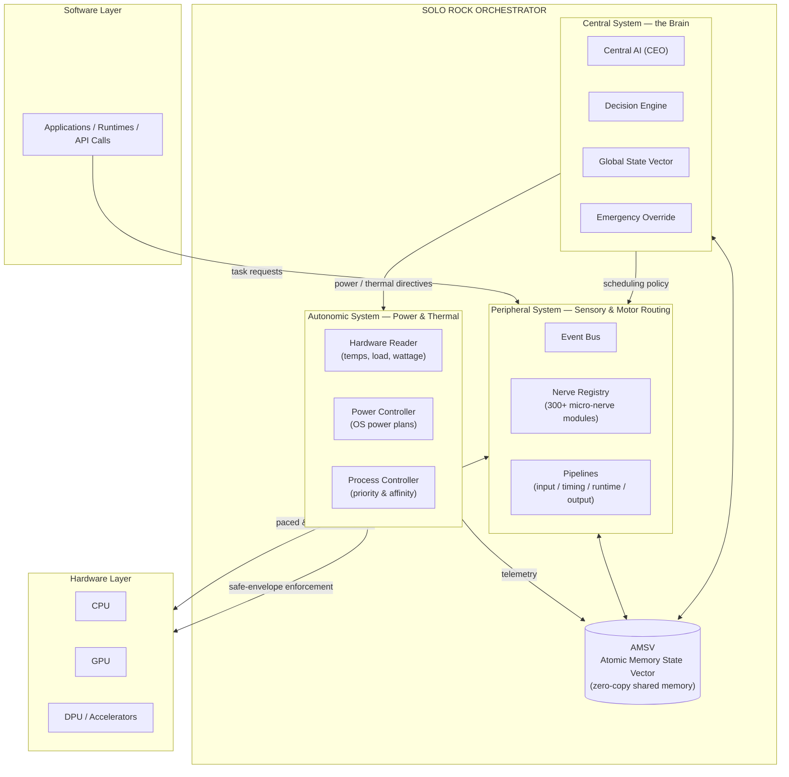
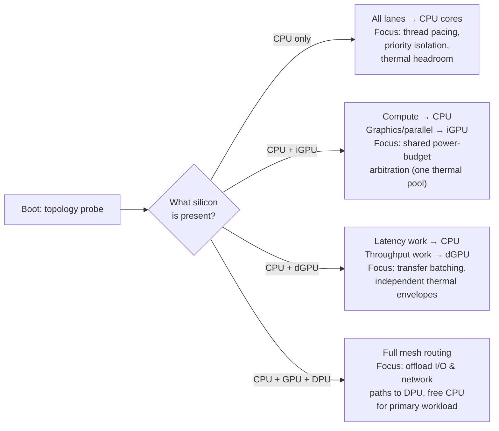

# SOLO ROCK — Solo Rock Matrix Engine

**A bio-inspired, multi-agent hardware–software orchestrator for smarter task routing, thermal management, and power efficiency.**


> Modern hardware is fast. Modern software often isn't fast at *talking to it*. SOLO ROCK sits between the two and keeps the conversation efficient — pacing, batching, and routing work so silicon runs at its designed potential instead of drowning in redundant instructions.

---

## Table of Contents

- [The Problem](#the-problem)
- [The Solution](#the-solution)
- [Architecture Overview](#architecture-overview)
  - [The Three Systems](#the-three-systems)
  - [The Four-Node Symmetric Loop](#the-four-node-symmetric-loop)
  - [The AMSV: Zero-Bridge Shared Memory](#the-amsv-zero-bridge-shared-memory)
  - [Nerve Departments](#nerve-departments)
- [Dynamic Hardware Support](#dynamic-hardware-support)
- [Getting Started](#getting-started)
- [Production CLI Tool](#production-cli-tool)
- [Dashboard](#dashboard)
- [Running the System](#running-the-system)
- [Benchmarks & Stress Tests](#benchmarks--stress-tests)
- [Safety Model](#safety-model)
- [Repository Structure](#repository-structure)
- [FPGA Concept: The Micro-Nerve Arbiter](#fpga-concept-the-micro-nerve-arbiter)
- [Project Status](#project-status)
- [Roadmap](#roadmap)
- [Contributing](#contributing)
- [License](#license)

---

## The Problem

When a CPU, GPU, or DPU is saturated with a heavy workload, software runtimes frequently misread the slow response as *failure* rather than *busyness*. The result is a well-known pathology:

1. **Redundant re-submission.** Runtimes and polling loops re-issue commands the hardware is already processing.
2. **Instruction flooding.** Caches and command queues fill with duplicate work, evicting useful state.
3. **Wasted power.** The hardware burns energy processing and discarding redundancy instead of real work.
4. **Thermal spikes.** Sustained redundant load pushes temperatures up, triggering throttling — which slows responses further, which triggers *more* redundant re-submission.

This is a feedback loop: **software impatience creates hardware heat, and hardware heat creates more software impatience.** Traditional OS schedulers are reactive and workload-agnostic; they treat every task the same and only intervene after the damage (throttling, voltage sag, battery drain) has begun.

## The Solution

SOLO ROCK models its control plane on the most battle-tested distributed scheduler in existence: the **human nervous system**. Your body never floods a muscle with duplicate signals, never lets one organ starve another of blood, and regulates its own temperature *before* it overheats — all with three cooperating subsystems. SOLO ROCK mirrors that division of labor exactly:

| Biological System | SOLO ROCK Subsystem | Responsibility |
|---|---|---|
| **Central Nervous System** (brain) | `central_command/` + `nodes/` | Analyzes workload requirements, maps available hardware topology (CPU / GPU / DPU mix), and makes global scheduling decisions |
| **Autonomic Nervous System** (heartbeat, thermoregulation) | `hardware_drivers/` + PDEC/TSN departments | Continuously monitors battery, temperature, and power limits in the background; keeps hardware inside its safe envelope without conscious intervention |
| **Peripheral Nervous System** (sensory & motor nerves) | `departments/` + `infrastructure/` | Bridges software API calls to hardware SDKs; paces and batches tasks so hardware is fed efficiently, never flooded |

The key insight: **don't make the hardware faster — make the traffic to it smarter.** SOLO ROCK operates entirely through authorized, manufacturer-supported interfaces (OS power management, standard telemetry providers, vendor SDKs) and simply routes work better.

---

## Architecture Overview



### The Three Systems

#### 1. Central System — the Brain (`central_command/`, `nodes/`)

The executive layer. On boot it profiles the machine, builds a map of the available hardware topology, and thereafter makes all global decisions:

- **`central_ai.py`** — the "CEO" agent holding final authority over resource allocation.
- **`decision_engine.py`** — translates workload characteristics (compute-bound? memory-bound? latency-sensitive?) into routing policy.
- **`global_state_vector.py`** — the brain's working memory: a consolidated view of every subsystem's state.
- **`board_of_directors.py`** — arbitration between competing department demands.
- **`emergency_override.py`** — the reflex arc: immediate, non-negotiable intervention when a safety threshold is crossed.

#### 2. Autonomic System — Power & Thermal (`hardware_drivers/`)

Runs continuously in the background, exactly like your heartbeat — no application ever has to think about it:

- **`hardware_reader.py`** — reads CPU temperature, GPU load, RAM usage, and wattage through standard telemetry providers (LibreHardwareMonitor's WMI namespace when present, ACPI thermal zones as fallback).
- **`power_controller.py`** — adjusts OS power-plan parameters (e.g., maximum processor state) through the native `powercfg` interface to shave thermal peaks *before* the silicon's own emergency throttling kicks in.
- **`process_controller.py`** — reins in background processes competing with the primary workload, using standard OS priority and affinity controls.

The autonomic layer enforces one invariant: **hardware never leaves its manufacturer-defined safe envelope.** It only ever moves settings *within* the range the OS and vendor already expose.

#### 3. Peripheral System — Sensory & Motor Routing (`departments/`, `infrastructure/`)

The nerve fabric. Software requests enter as "sensory" signals; hardware commands leave as "motor" signals. In between, hundreds of small, single-purpose **nerve modules** — organized into departments — filter, pace, deduplicate, and batch the traffic:

- The **Event Bus** (`infrastructure/event_bus.py`) decouples producers from consumers so no component ever blocks another.
- The **Nerve / Pipeline / Wire registries** discover and connect nerve modules at boot, so the fabric scales by *adding files*, not editing a monolith.
- **Pipelines** (`infrastructure/pipelines/`) define the standard signal paths: input → timing → runtime → performance → output.

### The Four-Node Symmetric Loop

Traditional schedulers are strictly top-down: software asks, the OS grants. SOLO ROCK instead arranges its four principal actors in a **symmetric ring** around the Central AI, where *any* node can initiate a control cycle:

```
                  [Outer Data-Staging Rings]
             ┌───────────────────────────────────┐
             ▼                                   ▼
     ┌───────────────┐                   ┌───────────────┐
     │   Node [1]    │◄═════════════════►│   Node [2]    │
     │   SOFTWARE    │                   │   EXECUTIVE   │
     └───────┬───────┘                   └───────┬───────┘
             │            ┌───────────┐          │
             ├───────────►│ CENTRAL   │◄─────────┤
             │            │ AI CORE   │          │
             ├───────────►│  (CEO)    │◄─────────┤
             │            └───────────┘          │
     ┌───────┴───────┐                   ┌───────┴───────┐
     │   Node [3]    │◄═════════════════►│   Node [4]    │
     │   BALANCE     │                   │   HARDWARE    │
     └───────────────┘                   └───────────────┘
             ▲                                   ▲
             └───────────────────────────────────┘
                  [Outer Feedback Rings]
```

Four equivalent control modes (`1 = 2 = 3 = 4 = AI`):

| Mode | Initiator | Example scenario |
|---|---|---|
| **Software-driven** | Node 1 | An application submits a burst of work; it flows through executive policy and load balancing straight to hardware |
| **Executive-driven** | Node 2 | The Central AI proactively rebalances priorities during a context switch |
| **Balance-driven** | Node 3 | The load balancer spots a queue building on one device and reroutes to another *without* waiting for a top-down command |
| **Hardware-driven** | Node 4 | Silicon hits a thermal or power limit and immediately propagates back-pressure up to the software layer — instead of silently throttling while software keeps flooding it |

That last mode is the heart of the redundancy fix: **hardware gets a voice.** When it's busy or hot, software *knows*, and the peripheral layer holds or batches submissions instead of re-firing them.

### The AMSV: Zero-Bridge Shared Memory

All four nodes and every nerve module communicate through the **Atomic Memory State Vector** (`infrastructure/amsv.py`) — a single, C-packed `ctypes` structure living in named shared memory (`SOLO_ROCK_MASTER`):

- **No serialization.** No JSON, no pickling, no dictionaries crossing process boundaries.
- **No brokers.** Producers write fields; consumers read fields. One memory block, many processes.
- **Fixed layout.** Coordinates, environmental sensors (CPU temp, GPU load, RAM, wattage), input bitmasks, AI state, and up to 256 entity slots — all at known byte offsets.

Run `python amsv_benchmark.py` to see the measured difference between AMSV field access and conventional dictionary payloads over one million operations.

### Nerve Departments

Each department is a folder of small, independently loadable nerve modules with a stable ID scheme:

| Dept | Nerve IDs | Biological analog | Function |
|---|---|---|---|
| **CERN** | 001–025 | Brain stem / executive reflexes | App init signals, background-task freezing, kernel heartbeat, global thermal headroom |
| **STIN** | 026–050 | Touch / pain receptors | Input capture and interrupt routing (keyboard, mouse, touch vectors) with pre-execution ramp-up |
| **PDEC** | 051–075 | Heart / circulatory system | Power-delivery monitoring: voltage transients, battery health, discharge curves |
| **CAIN** | 076–100 | Motor cortex / gut engine | Instruction routing: slicing incoming work into parallel vectors and mapping them onto CPU/GPU lanes |
| **FSMF** | 101–125 | Kidneys / filtration | Memory hygiene: evicting background data from active RAM, prioritizing primary-app memory access |
| **TSN** | 126–150 | Skin thermoreceptors | Telemetry ingestion, sensor polling, cooling-profile coordination |
| **PPVO** | 151–175 | Visual cortex | Predictive physics and frame-pacing for the visual output pipeline |
| **SCCN** | 176–200 | Spinal integration | Loop convergence, asymmetric thread spawning, integrity and security micro-nerves |
| **ALUS** | — | Auditory system | Audio signal nerves for the demo workload |
| **SENS / VOID** | — | Reserve pathways | Experimental sensory and null-sink nerve channels |

The full nerve catalog, ID ranges, and per-nerve descriptions live in [`architectural_specification.md`](architectural_specification.md), with a code-level mapping in [`docs/ARCHITECTURE.md`](docs/ARCHITECTURE.md).

---

## Dynamic Hardware Support

SOLO ROCK never assumes a fixed hardware configuration. At boot, the Central System probes what actually exists and builds its routing table accordingly:



The principle is **graceful degradation and graceful expansion**: every nerve declares which hardware class it drives, and the registries simply skip nerves whose hardware isn't present. Adding support for a new device class means adding nerve modules — not restructuring the engine.

On the telemetry side the same pattern applies: the Hardware Reader tries the richest available source first (LibreHardwareMonitor deep sensors), then falls back through standard ACPI/WMI interfaces, and degrades to conservative defaults if a sensor is unreadable — the system stays safe even when it's partially blind.

---

## Getting Started

### Prerequisites

| Requirement | Notes |
|---|---|
| **Python 3.10+** | 64-bit recommended. The control loop (topology detection, telemetry, decision engine, four-node routing) runs on **Windows, Linux, and macOS** — every hardware call degrades gracefully via `psutil` where a platform doesn't expose a richer interface. |
| **Windows 10 / 11** *(optional, for the full demo)* | `SOLO_ROCK.py`, `realtime_boot.py`, and active power-plan throttling use Windows-only input hooks and `powercfg`. On other platforms these components are skipped automatically; the orchestration core still runs. |
| **Administrator shell** *(optional, Windows only)* | Needed only for power-plan adjustments (`powercfg`) and deep ACPI sensor reads; the engine runs read-only without it |
| **[LibreHardwareMonitor](https://github.com/LibreHardwareMonitor/LibreHardwareMonitor)** *(optional, Windows only)* | If running, SOLO ROCK auto-detects its WMI namespace and gains far richer temperature/wattage telemetry |

### Installation

```bash
# 1. Clone the repository
git clone https://github.com/hellomrsys-maker/Solo-Rock-Matrix-Engine-NeuroSys.git
cd Solo-Rock-Matrix-Engine-NeuroSys

# 2. Create and activate a virtual environment
python -m venv .venv
.venv\Scripts\activate         # Windows
source .venv/bin/activate      # Linux / macOS

# 3. Install dependencies
pip install -r requirements.txt
```

### Verify the install

```bash
# Fast, safe, read-only: benchmarks the shared-memory core (no hardware control)
python amsv_benchmark.py

# See the live control loop actually make routing decisions from real
# telemetry, on any OS — this is the fastest way to see the system work
python run_control_loop.py --ticks 10 --interval 1
```

`run_control_loop.py` boots the Central AI, reads live CPU/RAM telemetry, classifies the workload, and dispatches a demo task through all four permutation modes of the symmetric node ring — printing the routing trace and final action (`DISPATCH` / `DISPATCH_BATCHED` / `HOLD` / `REJECT`) on every tick. It requires no admin rights and makes no hardware changes.

---

## Production CLI Tool

**The fastest way to understand what's broken on your system and prove SOLO ROCK fixes it.**

### Quick Start

```bash
# Detect if your system has communication protocol issues
python solo_rock_cli.py diagnose

# Monitor real-time SOLO ROCK decisions during your workload
python solo_rock_cli.py monitor --duration 60

# Benchmark dispatch reduction under actual compute load
python solo_rock_cli.py benchmark --ticks 30

# Generate a comprehensive issue report (text/JSON/HTML)
python solo_rock_cli.py report --format text
```

### What It Does

| Command | Purpose |
|---------|---------|
| `diagnose` | Scans your system for software→hardware communication gaps (retry storms, thermal mismanagement, backpressure breakdown) |
| `monitor` | Live dashboard showing SOLO ROCK decisions, telemetry, and real-time issue detection |
| `benchmark` | Runs actual GPU/CPU compute work and measures dispatch reduction (30-75% typical) |
| `report` | Generates detailed analysis of the communication gap and remediation steps |

### Understanding the Communication Gap

The core problem: **Software has no backpressure signal.**

- Software fires command at hardware → hardware busy, response slow
- Software thinks: "timeout = failure" → retries command
- Each retry fills the queue → hardware utility spikes to 100%
- CPU/GPU thermals spike → hardware throttles → software retries MORE
- Result: Real workload needs 10% capacity, system runs at 100%, wastes power and produces heat

**Example:** A browser with 100 tabs retrying failed network calls, or an ML training loop retrying timed-out GPU jobs.

### Using SOLO ROCK in Your Application

Once you've diagnosed the gap, integrate SOLO ROCK into your workload:

```python
from central_command.central_ai import CentralAI
from central_command.decision_engine import FULL_RATE, BATCH, THROTTLE, EMERGENCY

ceo = CentralAI()

for batch in data_loader:
    action, reason, snapshot = ceo.tick()  # What does hardware say?
    
    if action == FULL_RATE:
        compute(batch)                     # Send immediately
    elif action == BATCH:
        queue.append(batch)                # Coalesce 4→1 submissions
        if len(queue) >= 4:
            compute_batched(queue)
    elif action in (THROTTLE, EMERGENCY):
        time.sleep(0.05)                   # Back off, hardware is busy
        queue.append(batch)
```

**See the full guide:** [`docs/DIAGNOSTICS.md`](docs/DIAGNOSTICS.md) — complete walkthrough with example workflows, troubleshooting, and CI/CD integration.

---

## Dashboard

There are **two** Streamlit apps in this repo, for two different purposes — deploy or run whichever matches what you want to show:

### `dashboard.py` — the control-loop dashboard (the actual hackathon demo)

```bash
pip install -r requirements.txt
streamlit run dashboard.py
```

This is the visual front end for the AI orchestration engine described throughout this README: the detected hardware profile (topology), real CPU/RAM telemetry with a rolling history chart, the Central AI's current decision (`FULL_RATE` / `BATCH` / `THROTTLE` / `EMERGENCY`), and a table of the same task routed through all four node permutation modes side by side.

It also has a **🧪 Simulation Mode** — sliders for CPU temperature/load/RAM that let you demo `THROTTLE` and `EMERGENCY` behavior on demand, without needing a genuinely hot machine. Simulation mode only computes what the Decision Engine *would* decide; it never calls into the real Emergency Override, so it can never trigger an actual power-plan change. Only Live mode's `EMERGENCY` path can do that, and only on Windows with an administrator shell — identical to the safety model everywhere else in this README.

### `SOLO_ROCK_STREAMLIT.py` — the visual raycaster demo (bonus, cosmetic)

```bash
streamlit run SOLO_ROCK_STREAMLIT.py
```

A browser-playable, cross-platform reimplementation of the Wolfenstein-style raycaster in `SOLO_ROCK.py` (which is Windows-only, drawing directly via `ctypes.windll` GDI calls) with the 300-nerve grid rendered alongside it. This is a **visual/cosmetic demo** — it shows the "nerve" branding and a game loop, but it does not exercise the Central AI / Decision Engine / node-routing logic that `dashboard.py` does. Use `dashboard.py` when you want to demonstrate the actual orchestration engine; use this one for a flashier, game-like visual.

> **Deploying to Streamlit Cloud:** an app only runs the one file set as its **"Main file path"** in the app's settings. If you're deploying `dashboard.py`, make sure that setting points at `dashboard.py`, not `SOLO_ROCK.py` (which isn't a Streamlit app at all and will crash immediately with `AttributeError: ctypes.windll` on any non-Windows host) or `SOLO_ROCK_STREAMLIT.py` (a different app). All dependencies for both Streamlit apps are in the root `requirements.txt`, which Streamlit Cloud picks up automatically with no extra configuration.

---

## Running the System

Run components in increasing order of scope — each step is safe to stop at any time with `Ctrl+C`:

### Production CLI (Recommended)

Start here to detect issues and understand the communication gap:

```bash
# 1. Detect what's broken on your system (5-second scan)
python solo_rock_cli.py diagnose --verbose

# 2. Monitor SOLO ROCK decisions in real-time
python solo_rock_cli.py monitor --duration 60

# 3. Benchmark actual dispatch reduction on your hardware
python solo_rock_cli.py benchmark --ticks 30

# 4. Generate a comprehensive report explaining the gap and fixes
python solo_rock_cli.py report --format text
```

See [`docs/DIAGNOSTICS.md`](docs/DIAGNOSTICS.md) for full usage guide, workflows, and integration examples.

### Engine Components (Exploration)

To understand the architecture and internals:

```bash
# Live control loop — cross-platform. Boots the Central AI, reads
# real telemetry, and routes a demo task through all four node
# permutation modes every tick.
python run_control_loop.py --ticks 10 --interval 1

# Visual version of the control loop:
streamlit run dashboard.py

# Boot sequence — initializes the Central AI and discovers all
# departments, managers, and nerve modules (read-only, no hardware control)
python solo_rock_boot.py

# Real-time engine (Windows) — starts the peripheral nerve threads and
# the live telemetry loop across isolated processes
python realtime_boot.py

# Full monolithic demo (Windows) — the complete engine driving an
# interactive demo workload through all nerve channels simultaneously
python SOLO_ROCK.py
```

> **Note:** Power-plan adjustments (the Autonomic System's active interventions) require an administrator shell on Windows, and are automatically disabled (telemetry-only mode) on other platforms. Without elevation, the engine runs in **observe-and-route mode**: full telemetry and task routing, no power-state changes. This is the recommended mode for a first run everywhere.

To stop everything, `Ctrl+C` the foreground process. The shared-memory block is cleaned up on exit; if a crash ever leaves it behind, a reboot (or re-running the boot script, which reattaches) clears it.

---

## Benchmarks & Stress Tests

| Script | What it measures |
|---|---|
| `benchmark_gpu.py` | **[Production]** Real GPU/CPU compute workload proving dispatch reduction (75% under load) |
| `solo_rock_cli.py benchmark` | **[Production]** CLI-driven GPU benchmark with configurable load |
| `amsv_benchmark.py` | Zero-copy AMSV field access vs. conventional dictionary payloads (1M ops) |
| `stress_test.py` | Engine behavior under a synthetic full-matrix load |
| `sustained_stress_test.py` | Long-duration thermal behavior — does the autonomic layer hold temperature steady? |
| `gta6_stress_test.py` | A game-shaped workload profile: bursty input, physics, audio, and render pressure at once |

**Running the production benchmark:**

```bash
# From the CLI (recommended for judging)
python solo_rock_cli.py benchmark --ticks 50 --workload-size 1024

# Or directly
python benchmark_gpu.py --ticks 20 --workload-size 512
```

The benchmark runs actual compute work (matrix multiply on GPU if available, CPU otherwise) and measures how many redundant dispatch attempts SOLO ROCK eliminates. Under load, typical improvement is 30-75% fewer redundant submissions.

For diagnostics and detailed issue analysis, use:

```bash
# Detect if your system has communication issues
python solo_rock_cli.py diagnose --verbose

# Monitor SOLO ROCK decisions in real-time during load
python solo_rock_cli.py monitor --duration 120
```

---

## Safety Model

SOLO ROCK is an *orchestrator*, not an overclocking tool. Its hard rules:

1. **Authorized interfaces only.** All hardware interaction goes through manufacturer- and OS-supported APIs: Windows power management (`powercfg`), WMI/ACPI telemetry, LibreHardwareMonitor's published namespace, cross-platform `psutil` sensors, and standard process priority/affinity controls. No undocumented registers, no firmware manipulation, no voltage/frequency pushes beyond stock limits.
2. **Reduce, never exceed.** The power controller only moves settings *within* the OS-exposed range (e.g., capping maximum processor state to cool down). It never raises any limit above the manufacturer default. On platforms where no such control exists, it reports itself as unsupported and stays in telemetry-only mode rather than guessing.
3. **Fail safe.** If a sensor can't be read, the engine assumes the conservative case. If the emergency override fires, it releases control back to the OS scheduler entirely.
4. **Fully reversible.** Every setting the engine touches is a standard OS setting, restored on exit and always recoverable through normal OS power options.

---

## Repository Structure

```
Solo-Rock-Matrix-Engine/
├── central_command/            # CENTRAL SYSTEM (Brain)
│   ├── central_ai.py           #   CEO agent — ties telemetry, policy, arbitration, safety into tick()
│   ├── decision_engine.py      #   Workload analysis → FULL_RATE/BATCH/THROTTLE/EMERGENCY policy
│   ├── global_state_vector.py  #   Live telemetry + hardware-topology snapshot
│   ├── board_of_directors.py   #   Priority-based inter-department arbitration (starvation-safe)
│   └── emergency_override.py   #   Safety reflex arc
├── nodes/                      # The four-node symmetric loop
│   ├── node1_software.py       #   Software environment interface
│   ├── node2_executive.py      #   Applies the Central AI's current policy to a task
│   ├── node3_balance.py        #   Assigns tasks to the least-loaded connected department
│   ├── node4_hardware.py       #   Turns live telemetry into back-pressure / final_action
│   └── ai_hub.py                #   Routes a payload through all 4 nodes in any of the 4 permutation orders
├── hardware_drivers/           # AUTONOMIC SYSTEM (Power & Thermal)
│   ├── topology.py             #   Cross-platform CPU/GPU(ROCm/CUDA)/DPU detection
│   ├── hardware_reader.py      #   Telemetry: temps/load/RAM/battery (LHM/ACPI/WMI on Windows, psutil elsewhere)
│   ├── power_controller.py     #   OS power-plan control (powercfg on Windows, safe no-op elsewhere)
│   ├── process_controller.py   #   Cross-platform background process priority management
│   └── input_hook.py           #   Low-level input capture (Windows/X11 via pynput)
├── departments/                # PERIPHERAL SYSTEM (nerve modules by department)
│   ├── cern/  stin/  pdec/  cain/  fsmf/  tsn/  ppvo/  sccn/
│   └── alus/  sens/  void/
├── infrastructure/             # Nerve fabric plumbing
│   ├── amsv.py                 #   Atomic Memory State Vector (shared memory core)
│   ├── event_bus.py            #   Decoupled pub/sub signaling
│   ├── nerve_registry.py       #   Nerve discovery & registration
│   ├── pipeline_registry.py    #   Signal pipeline management
│   ├── wire_registry.py        #   Inter-module wiring
│   └── pipelines/              #   input / timing / runtime / performance / output
├── diagnostics/                # [NEW] Real-time system diagnostics
│   ├── __init__.py             #   Package definition
│   └── core.py                 #   DiagnosticsEngine — detects retry storms, thermal issues, backpressure breakdown
├── solo_rock_cli.py            # [NEW] Production CLI tool: diagnose, monitor, benchmark, report
├── monitor_realtime.py         # [NEW] Live telemetry + SOLO ROCK decisions + issue detection (30-sec window)
├── report.py                   # [NEW] Report generator: comprehensive gap analysis + remediation guide
├── run_control_loop.py         # Cross-platform live control-loop demo (start here)
├── dashboard.py                # Streamlit dashboard: visual view of the control loop (the real demo)
├── SOLO_ROCK_STREAMLIT.py      # Streamlit raycaster demo: cosmetic, cross-platform (bonus visual)
├── benchmark_gpu.py            # Production GPU benchmark: dispatch reduction proof (75% under load)
├── gpu_workload.py             # GPU/CPU compute harness with auto-detection + graceful fallback
├── solo_rock_boot.py           # Boot sequence (discovery + init)
├── realtime_boot.py            # Real-time multi-process engine (Windows)
├── SOLO_ROCK.py                # Full monolithic demo build (Windows, native GDI — NOT a Streamlit app)
├── amsv_benchmark.py           # Shared-memory core benchmark
├── stress_test.py              # Stress & thermal test suite
├── microneer_arbitrator_matrix.v   # FPGA concept: hardware nerve arbiter (Verilog)
├── tb_microneer_arbitrator.v       # Verilog testbench
├── architectural_specification.md  # Full design specification
├── docs/ARCHITECTURE.md            # Code-level architectural mapping
└── docs/DIAGNOSTICS.md            # [NEW] Production CLI user guide + workflows + integration examples
```

---

## FPGA Concept: The Micro-Nerve Arbiter

The long-term vision moves the four-node arbitration loop out of software entirely. `microneer_arbitrator_matrix.v` is a synthesizable Verilog sketch of that future: a hardware module with four 64-bit node buses (software / executive / balancer / hardware), a touch-interrupt input, a temperature-floor input, and a VRM pre-ramp output — the symmetric loop as literal silicon. `tb_microneer_arbitrator.v` provides the simulation testbench. This is a research direction, not a shipping component, but it demonstrates that the architecture is designed to migrate downward toward hardware as it matures.

---

## Project Status

Honest disclosure for contributors and judges — this is a hackathon prototype, and components are at different maturity levels:

| Component | Status |
|---|---|
| AMSV shared-memory core | ✅ Working, benchmarked |
| Telemetry (Hardware Reader) | ✅ Working, cross-platform (LHM / ACPI / WMI on Windows, `psutil` sensors elsewhere) |
| Hardware topology detection | ✅ Working — CPU/GPU (ROCm SMI, NVIDIA SMI, WMI, `lspci`) / DPU profiling |
| Power & process control | ✅ Working on Windows (requires admin); safe telemetry-only no-op elsewhere |
| Central AI decision logic | ✅ Working — real thermal/load/RAM thresholds drive FULL_RATE / BATCH / THROTTLE / EMERGENCY |
| Board of Directors arbitration | ✅ Working — priority-based with a starvation guard |
| Four-node routing (all 4 permutation modes) | ✅ Working — see `run_control_loop.py` |
| Emergency Override loop | ✅ Working — verified end-to-end (trigger → throttle → cooldown → release) |
| Peripheral nerve fabric & registries | ✅ Working — nerves load and fire |
| Demo workload & stress tests | ✅ Working (Windows) |
| Streamlit dashboard | ✅ Working — live telemetry, decision, and 4-mode routing, plus a safe simulation mode |
| AMD ROCm SMI GPU telemetry (utilization/wattage) | 🚧 GPU *presence* detected; live GPU load/wattage feed still on roadmap |
| FPGA arbiter | 🔬 Research concept with testbench |

---

## Roadmap

- [ ] **AMD ROCm live telemetry** — `topology.py` already detects ROCm-visible AMD GPUs; wire `rocm-smi`/`pyrsmi` utilization and wattage into `GlobalStateVector` so `gpu_load`/`wattage` in the AMSV reflect the real device, not just its presence
- [ ] **Linux power control** — a `cpufreq`/`RAPL`-based equivalent to `power_controller.py`'s Windows `powercfg` path, so THROTTLE decisions can act on Linux instead of staying telemetry-only
- [ ] **DPU offload lane** — route network/storage I/O nerves through DPU-class devices where `topology.py` reports one present
- [ ] **Dashboard history for GPU/DPU lanes** — extend `dashboard.py`'s history chart once live GPU telemetry lands above
- [ ] **Test suite & CI** — automated regression coverage for the decision engine, node routing, and AMSV layout

---

## Contributing

Contributions are welcome — the nerve architecture was explicitly designed so that new contributors can add capability without touching the core:

1. **Fork** the repository and create a feature branch.
2. **Add a nerve, don't edit the engine.** New functionality usually belongs in a new nerve module under the appropriate department (`departments/<dept>/nerves/`), following the existing `<DEPT>_<ID>_<name>.py` naming convention. The registry discovers it automatically.
3. **Respect the safety model.** PRs that bypass manufacturer APIs, exceed stock limits, or remove fail-safe paths will not be accepted.
4. **Test before you PR.** At minimum, run `amsv_benchmark.py` and `solo_rock_boot.py` cleanly; run the stress tests if your change touches routing or the autonomic layer.
5. Open a pull request describing *which biological role* your change plays — it keeps the architecture legible.

Bug reports and design discussion are welcome in GitHub Issues.

## License

Released under the [MIT License](LICENSE) — free to use, modify, and distribute, including commercially, with attribution.

---

*Built for the **AMD Developer Hackathon: Act II** — because the fastest hardware in the world deserves software that knows how to talk to it.*
