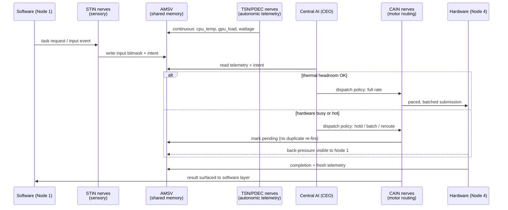

# SOLO ROCK — Architectural Mapping

This document maps the **biological design model** of the Solo Rock Matrix Engine onto the **actual code** in this repository. It is the bridge between the high-level [`README.md`](../README.md) and the full design text in [`architectural_specification.md`](../architectural_specification.md).

Audience: contributors and reviewers who want to know *where* each concept lives, *how* signals flow at runtime, and *which* interfaces each layer is allowed to touch.

---

## Table of Contents

- [1. Design Philosophy](#1-design-philosophy)
- [2. Layer-by-Layer Code Mapping](#2-layer-by-layer-code-mapping)
- [3. The AMSV Memory Contract](#3-the-amsv-memory-contract)
- [4. Runtime Signal Flow](#4-runtime-signal-flow)
- [5. The Nerve Module Contract](#5-the-nerve-module-contract)
- [6. Department Catalog](#6-department-catalog)
- [7. Hardware Abstraction & Fallback Chains](#7-hardware-abstraction--fallback-chains)
- [8. Process & Thread Topology](#8-process--thread-topology)
- [9. The FPGA Arbiter Concept](#9-the-fpga-arbiter-concept)
- [10. Extension Points](#10-extension-points)

---

## 1. Design Philosophy

Three rules drive every structural decision in this codebase:

1. **Shared state is memory, not messages.** Components never exchange serialized payloads on a hot path. They read and write fixed offsets in one C-packed shared-memory block (the AMSV). A "signal" between two nerves is a field write followed by a field read — nothing more.
2. **Capability lives in leaves.** The engine core (`infrastructure/`) knows how to *discover, wire, and schedule* nerves; it knows nothing about what any nerve does. All behavior lives in small, single-purpose nerve modules under `departments/`.
3. **Any layer may initiate control.** The four principal nodes (software, executive, balance, hardware) form a symmetric ring around the Central AI. Back-pressure from hardware is a first-class control signal, not an error condition — this is what breaks the redundant-resubmission feedback loop described in the README.

## 2. Layer-by-Layer Code Mapping

### 2.1 Central System — "the Brain"

| Concept (spec) | Code | Role |
|---|---|---|
| Central AI Core / CEO | `central_command/central_ai.py` | Singleton executive authority; owns the override right over every department |
| Decision Engine | `central_command/decision_engine.py` | Workload classification → routing policy |
| Global State Vector | `central_command/global_state_vector.py` | Brain-local consolidated snapshot of system state |
| Board of Directors | `central_command/board_of_directors.py` | Arbitration when departments make competing resource demands |
| Emergency Override (reflex arc) | `central_command/emergency_override.py` | Unconditional intervention path when a safety threshold trips |

> **Status note:** the Central System interfaces are defined but the decision heuristics are still scaffolded (`CentralAI.override_all` and node `route_payload` methods are stubs). This is the primary area of active development — see [Extension Points](#10-extension-points).

### 2.2 The Four Nodes

| Node | Code | Direction of concern |
|---|---|---|
| Node 1 — Software | `nodes/node1_software.py` | Application/runtime side of the loop: intake of task requests |
| Node 2 — Executive | `nodes/node2_executive.py` | Policy application: priorities, context switches |
| Node 3 — Balance | `nodes/node3_balance.py` | Queue and lane monitoring; reroute on choke points |
| Node 4 — Hardware | `nodes/node4_hardware.py` | Silicon telemetry ingestion; source of back-pressure signals |
| AI Hub | `nodes/ai_hub.py` | The center of the ring; routing fabric between the four nodes |

Each node exposes `route_payload(payload)` and holds `connected_departments`. The four permutation modes described in the spec (`1=2=3=4=AI`, `2=3=4=1=AI`, …) correspond to *which node initiates* a routing cycle through the hub — the code path is identical, only the entry point differs.

### 2.3 Autonomic System — Power & Thermal

| Concept | Code | OS interface used |
|---|---|---|
| Temperature / load / wattage sensing | `hardware_drivers/hardware_reader.py` | LibreHardwareMonitor WMI namespace → `MSAcpi_ThermalZoneTemperature` (ACPI) → conservative fallback |
| Power-envelope control | `hardware_drivers/power_controller.py` | `powercfg` (Windows power plans; e.g., subgroup `54533251-…` / setting `bc5038f7-…` = Maximum Processor State) |
| Background-process restraint | `hardware_drivers/process_controller.py` | Standard OS process priority / affinity controls (via `psutil`) |
| Raw input capture | `hardware_drivers/input_hook.py` | `pynput` listener hooks |

**Invariant:** this layer may only move settings *within* the manufacturer/OS-exposed range, and only *downward* relative to stock limits (throttle-to-cool, never boost-beyond-spec). See the Safety Model in the README.

### 2.4 Peripheral System — the Nerve Fabric

| Concept | Code | Role |
|---|---|---|
| Shared memory core (AMSV) | `infrastructure/amsv.py` | The single source of truth all processes attach to |
| Event Bus | `infrastructure/event_bus.py` | Decoupled pub/sub for non-hot-path signaling |
| Nerve Registry | `infrastructure/nerve_registry.py` | Discovers and registers nerve modules at boot |
| Pipeline Registry | `infrastructure/pipeline_registry.py` | Manages the five standard signal pipelines |
| Wire Registry | `infrastructure/wire_registry.py` | Point-to-point connections between registered modules |
| Base classes | `infrastructure/nerve_base.py`, `manager_base.py`, `department_base.py` | Contracts every nerve/manager/department implements |
| Pipelines | `infrastructure/pipelines/` | `input_comm` → `timing_comm` → `runtime` → `performance` → `output` |
| World map | `infrastructure/world_map.py` | Spatial state for the demo workload |

## 3. The AMSV Memory Contract

`infrastructure/amsv.py` defines the **Atomic Memory State Vector** — one `ctypes.Structure` with `_pack_ = 1` (zero padding, deterministic offsets), placed in named shared memory **`SOLO_ROCK_MASTER`**. Every process attaches to the same block; there is no copy, no broker, no serialization.

Layout (in field order):

| Block | Fields | Type | Purpose |
|---|---|---|---|
| Coordinate matrix *(legacy)* | `coord_x, coord_y, coord_z, rotation` | 4 × `float` | Demo-workload position state |
| **Environmental sensors** | `cpu_temp, gpu_load, ram_usage, wattage` | 4 × `float` | **The autonomic telemetry heartbeat** — written by the Hardware Reader loop, read by every layer |
| Input bitmasks | `mouse_state, keyboard_state, controller_1, controller_2` | 4 × `uint32` | STIN sensory nerves write; CAIN motor nerves read |
| AI / engine state *(legacy)* | `ai_target_x, ai_target_y, health_state, time_delta` | 4 × `float` | Central-loop working values |
| Entity array | `entity_count` + `entities[256]` | `uint32` + 256 × `EntityState` (11 fields each) | Demo-workload entity pool exercised by the stress tests |

Rules for contributors:

- **Never reorder or remove fields.** Offsets are the ABI. Add new fields at the end and bump any size checks.
- **One writer per field.** Each field has exactly one producing subsystem; everyone else is a reader. This is what makes lock-free operation safe in practice.
- **Measure before arguing.** `amsv_benchmark.py` exists precisely to keep the zero-copy claim honest — run it when touching this file.

## 4. Runtime Signal Flow

The canonical cycle — a burst of input arriving while the hardware is already warm:



The critical property is in the `else` branch: when hardware is saturated, the request is **held and marked in shared state** rather than re-submitted. The software layer sees "busy, pending" instead of silence — which is exactly what eliminates the redundant-command flood, the cache pollution, and the resulting thermal spike.

## 5. The Nerve Module Contract

A nerve is the smallest unit of behavior. Conventions:

- **Location:** `departments/<dept>/nerves/`
- **Naming:** `<dept>_<NNN>_<snake_case_name>.py` containing class `<DEPT>_<NNN>_<CamelCaseName>` (e.g., `stin_001_keyboard_nerve_1.py` → `STIN_001_KeyboardNerve1`)
- **Lifecycle:** constructed once, then `fire()` runs its loop (typically on a daemon thread or isolated process)
- **I/O:** reads and writes **only** AMSV fields and event-bus topics — a nerve never imports another nerve
- **Discovery:** the nerve registry finds modules by path convention; adding a file adds a capability, no core edits required

Managers (`departments/<dept>/managers/*_mgr.py`) group and supervise nerves within a department; each department also has a `department_ai.py` acting as its local coordinator, subordinate to the Central AI.

## 6. Department Catalog

Nerve ID ranges follow the master plan in [`architectural_specification.md`](../architectural_specification.md) (Chapter 6):

| Code | Name (biological analog) | ID range | System | Concern |
|---|---|---|---|---|
| **CERN** | Central Executive Reflex Nerves (brain stem) | 001–025 | Central | Init signals, background freeze, kernel heartbeat, thermal headroom ΔT |
| **STIN** | Sensory Touch Interrupt Nerves (pain matrix) | 026–050 | Peripheral (sensory) | Keyboard/mouse/touch vectors, pre-execution ramp |
| **PDEC** | Power Delivery & Electrochemical Nerves (heart) | 051–075 | Autonomic | Voltage transients, battery health, discharge curves |
| **CAIN** | Compute Allocation & Interconnect Nerves (motor cortex) | 076–100 | Peripheral (motor) | Instruction slicing and CPU/GPU lane routing |
| **FSMF** | File System & Memory Filtration Nerves (kidneys) | 101–125 | Peripheral | RAM hygiene, priority memory access |
| **TSN** | Telemetry & Sensor Nerves (thermoreceptors) | 126–150 | Autonomic | Sensor polling, cooling-profile coordination |
| **PPVO** | Predictive Physics & Visual Output Nerves (visual cortex) | 151–175 | Peripheral | Physics prediction, frame pacing |
| **SCCN** | Symmetric Core Convergence Nerves (spinal integration) | 176–200 | Central/Peripheral | Loop convergence, thread spawning, integrity micro-nerves |
| **ALUS** | Audio nerves (auditory system) | — | Peripheral | Audio pipeline for the demo workload |
| **SENS** | Reserve sensory channels | — | Peripheral | Experimental |
| **VOID** | Null-sink channels | — | Peripheral | Signal termination / discard paths |

Later spec chapters define further ranges (HEMM 201–215 memory mapping, TTSS 216–225 thermal shifting, ESSK 226–235 isolation, FMLC/VRFP 236–250 output convergence) that are design targets not yet materialized as department folders.

## 7. Hardware Abstraction & Fallback Chains

Every telemetry read degrades gracefully through a fixed chain, so the engine works on machines with very different sensor exposure:

```
CPU temperature:
  LibreHardwareMonitor WMI (root/LibreHardwareMonitor, SensorType=Temperature)
    └─ fallback → ACPI thermal zone (root/wmi, MSAcpi_ThermalZoneTemperature, deci-Kelvin)
         └─ fallback → 0.0 sentinel  ⇒  consumers treat "unknown" as "assume hot" (conservative)
```

The same shape applies to the topology question in the README: nerves declare the hardware class they drive, registries skip nerves whose hardware is absent, and the routing table is built from what actually probed present — CPU-only machines simply run with the CAIN GPU lanes unregistered.

Planned extensions of this chain (see README roadmap): ROCm SMI for AMD GPU telemetry, and Linux `hwmon`/RAPL/`cpufreq` equivalents for each Windows interface above.

## 8. Process & Thread Topology

Two runtime shapes exist today:

**`realtime_boot.py` — isolated multiprocess mode.** Each biological subsystem gets its own OS process, all attached to the same `SOLO_ROCK_MASTER` shared-memory block:

- *PNS/STIN process:* keyboard + mouse nerves on daemon threads
- *CAIN process:* player physics + instruction-routing nerves
- *(additional department processes started analogously)*

Process isolation means a fault in one subsystem cannot take down the loop — the biological analog is that a numb finger doesn't stop the heart.

**`SOLO_ROCK.py` — monolithic demo mode.** All nerve groups run as daemon threads inside one process (hardware-overlord, input, audio, physics, telemetry, render). This is the packaged demo (`SOLO_ROCK.exe` via PyInstaller — see `SOLO_ROCK.spec` / `BUILD_MATRIX.bat`) and the easiest way to see the whole system move at once.

`solo_rock_boot.py` is the discovery pass: it initializes the Central AI, walks the eight primary departments, and registers managers and nerve paths — useful as a smoke test and as the reference for how the registries are populated.

## 9. The FPGA Arbiter Concept

`microneer_arbitrator_matrix.v` expresses the four-node symmetric loop as synthesizable hardware:

| Port | Width | Maps to |
|---|---|---|
| `node1_software_in/out` … `node4_hardware_in/out` | 4 × 64-bit in + out | The four perimeter node buses of the ring |
| `stin_pain_interrupt` | 16-bit | STIN sensory interrupt vector |
| `ttss_temp_floor` | 16-bit | Live temperature-floor reading (thermal back-pressure input) |
| `pdec_vrm_preramp` | 1-bit | PDEC's voltage pre-ramp command (the "reactive pre-execution sync") |

`tb_microneer_arbitrator.v` is the simulation testbench. The point of this artifact is architectural, not product: it demonstrates that the arbitration loop is simple and regular enough to migrate below the OS entirely — the software engine is a prototype of a mechanism that could ultimately live in silicon or on a DPU.

## 10. Extension Points

Ordered by impact for new contributors:

1. **Decision heuristics** (`central_command/decision_engine.py`, `central_ai.py`) — replace scaffolded stubs with measured policy: classify workload from AMSV telemetry history, emit hold/batch/reroute decisions.
2. **Node routing** (`nodes/*.py`) — implement `route_payload` for each node so all four permutation modes are exercisable end-to-end.
3. **New telemetry providers** (`hardware_drivers/hardware_reader.py`) — extend the fallback chain (ROCm SMI, Linux hwmon) without changing any consumer: consumers only ever read AMSV fields.
4. **New nerves** (`departments/<dept>/nerves/`) — the intended everyday contribution: one file, one behavior, auto-discovered.
5. **Visualization** (`v4_pixel_visualizer.html`) — live AMSV dashboards; the memory layout in §3 is the read contract.

When in doubt, preserve the three rules in §1 — they are the architecture.
